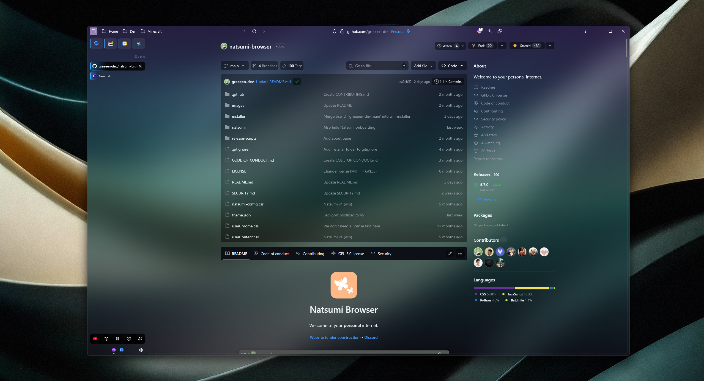
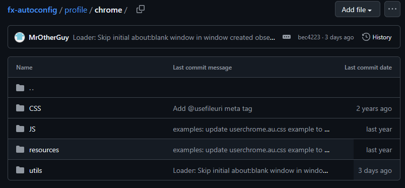
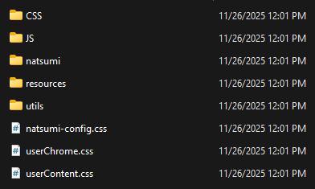
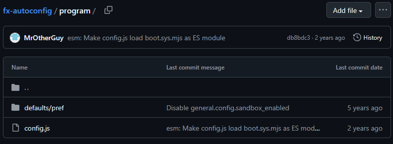
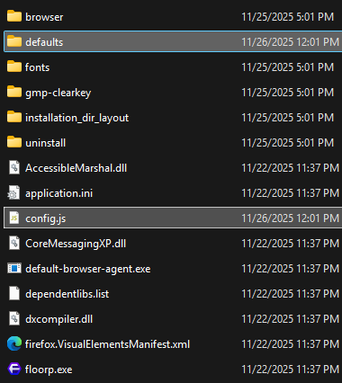
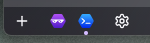
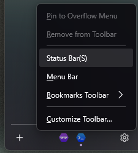

<h1 align="center"> Wazz's Natsumi Setup Guide </h1>

<h3 align="center"> 


<br/>

⬇️ Follow the steps below to achieve this look ⬇️</h3>



# Features
- Transparent custom themes with gradient sharing
- Pinned tabs grid
- Multiple Tab Styles
- Clear Tabs button
- Floating URL Bar
- Media Miniplayer
- Reimagined Picture-in-picture
- Modern PDF Viewer
- Single Toolbar
- Custom Keyboard Shortcuts
- Compact Mode
- Custom Icon
- Transparent Websites (via Zen Internet Extension)
- Workspaces as an icon strip (Floorp only)

<br/>

# Table of Contents
[Step 1 – Installing](#step-1-installing)

[Step 2 – Browser Settings](#step-2-browser-settings)

[Step 3 – Natsumi Settings](#step-3-natsumi-settings)

[Step 4 – Toolbar/Sidebar/Bookmark Bar Arrangement](#step-4-toolbarsidebarbookmark-bar-arrangement)

[Step 5 – Extensions](#step-5-extensions)

[Step 6 - Custom Icon](#step-6-custom-icon)


<br/>

## Step 1 - Installing
### Windows Installation
- Download and run [Windows-installer.bat](https://github.com/greeeen-dev/natsumi-browser/blob/main/installer/windows-installer.bat) as Admin
- Follow the on screen prompts

> [!NOTE]
> - You must have [Git](https://git-scm.com/install/windows) installed for the Windows Installer to work.
> - Know the name of your browser profile, the Windows installer will ask for it. (about:profiles)
> - The Windows installer needs to run as Admin so it can copy the needed files to the correct system locations.
> - To update Natsumi on Windows, run the `windows-installer.bat` again with your browser closed.

<br/>

### Mac/Linux Installation
- Download and run the latest installer from the [Releases](https://github.com/greeeen-dev/natsumi-browser/releases) page
> [!NOTE]
> For macOS users, you will need to override the unsigned binary warning (also known as the "Apple could
> not verify "App" is free of malware" warning) by going to System Preferences => Security & Privacy
> after trying to run the installer.

<br/>

### Sine Installation
> [!WARNING]
> Installing via Sine is supported but not recommended. The following features will not work:
> - Any features included in Natsumi Append
> - Icon packs aside from Firefox default

You can install the CSS-only version of Natsumi through [Sine](https://github.com/CosmoCreeper/Sine).

<br/>

### Manual Installation
> [!NOTE]
> - Remember to take backups of your userChrome.css and userContent.css files before proceeding!
> - Know how to access your profile's Chrome folder before proceeding! (about:profiles -> Root Directory -> Open Folder)
> - Know the installation location of your browser before proceeding! (e.g. `C:\Program Files\Ablaze Floorp` )

#### Installing Natsumi Browser and Natsumi Browser Pages
1. Copy natsumi-config.css, userChrome.css, userContent.css and natsumi folder to your chrome folder.
2. That's it - Natsumi (CSS-only) is installed!

#### Installing Natsumi Append
Installing Natsumi Append allows you to use the full feature set of Natsumi Browser, but it's not
required for the core parts of Natsumi to work.

Natsumi Browser needs to be installed before you can install Natsumi Append.

**1.** Install [fx-autoconfig](https://github.com/MrOtherGuy/fx-autoconfig) to your browser. 
   - Copy these files and directories from the repo into the Chrome folder for your profile:


   - Your Chrome folder should look like this:
  
      

   - Copy these files and directories from the repo into the installation location for your browser.
   (The same location as Floorp.exe etc.)


   - Your installation directory should have both the `defaults` folder and the `config.js` file in the same location as the program binary (e.g. the '.exe' file)

       

   **Flatpak users**: You may need to follow steps 1 and 2 on
   [here](https://github.com/MrOtherGuy/fx-autoconfig/issues/48#issuecomment-3315929253), but replace
   `app.zen_browser.zen` with the package identifier of your browser (e.g. `one.ablaze.floorp`).

**2.** Copy the following to chrome/utils/chrome.manifest:
   ```
   content userchromejs ./
   content userscripts ../natsumi/scripts/
   skin userstyles classic/1.0 ../CSS/
   content userchrome ../resources/
   content natsumi ../natsumi/
   content natsumi-icons ../natsumi/icons/
   ```
**3.** Go to about:config and create `userChromeJS.persistent_domcontent_callback` and set it to True

**4.** Go to about:support and clear your startup cache and restart your browser.

**5.** That's it - Natsumi Append is installed!

#### Advanced setup: If you are a techie who wants to keep your files up-to-date with new changes over time
After following either of the above steps, if you are interested in ensuring that you upgrade to the
latest version of Natsumi as new changes are released, you can simply clone the repository into the `chrome`
folder. This can be followed up with `git pull` from time-to-time.

<br/>

## Step 2 – Browser Settings

>[!Note]
>Some browser settings are Floorp specific.
### On Natsumi first launch
- Select **Multiple Toolbars**
- Pick your desired Accent Color
- Pick your desired Theme (we will change this soon)
- Pick your desired Icon Style (I use **Lucide**)
- Pick your desired URL Bar Style (I use **Floating**)

### After Natsumi Onboarding
- Right click Toolbar and select "**Turn on Vertical Tabs**"
- Right click Sidebar and select "**Customize Sidebar**"
  - ✖️Uncheck "**Expand sidebar on hover**"
  - ✖️Uncheck "**Hide tabs and sidebar**"
  - ✖️Uncheck "**Move sidebar to the right**" (not required)
  - ✖️Uncheck all "**Floorp Tools**" like AI Chatbot and History

<br/>

- Go to "**about:preferences**" and select "**Floorp Hub**"
  - Go to "**Tab & Appearance**"
    - Keep "**Proton**" selected under "**Interface**"
    - Scroll to "**Tabs**" section
    - Select "**Open at the end of the tab bar**"
    - Set "**Minimum tab height**" to `20`
    - Scroll to "**UI Customization**" and toggle "**Disable Floorp Start**" to on.
    - Restart Floorp when prompted
  - Go to "**Panel Sidebar**" and turn the toggle to off.
  
<br/>

- Go to "**about:preferences#home**"
  - Set "**Homepage and new windows**" to `Blank Page`
  - Set "**New Tabs**" to `Blank Page`

<br/>

- Go to "**about:config**" and accept the warning
  - Type `browser.tabs.allow_transparent_browser` and set it to `true`
  - Type `widget.windows.mica` and set it to `true`

## Step 3 – Natsumi Settings
- Go to "**about:preferences**" and select "**Customize Natsumi**"
  - Scroll to "**Background Theme**"
    - Select "**Custom**"
    - Select the **import button** (down arrow icon)
    - Import `natsumi-gradient.json` from this repo
    - ☑️Check the box for "**Enable translucency effect**"

> [!Note]
> - Natsumi custom themes have 4 different states- 2 themes for Light Mode and 2 for Dark Mode.
> - Make sure you import the gradient file under the correct state you want to use. 
> - (**e.g.** Pick your workspace (or all workspaces) then select Dark Mode icon (moon) and pick state 1 or 2, then import the gradient.)

  - Scroll to "**Sidebar & Tabs**"
    - Select your desired Tab design
    - ✖️Uncheck "**Show current Workspace indicator**"
    - ☑️Check "**Display Workspaces as an icon strip**"
    - ✖️Uncheck "**Disable clickable Workspace icons**"
    - ☑️Check "**Enable Workspace-specific pinned tabs**"
      - Scroll to "**Buttons**" 
      - ☑️Check "**Use Status Bar in the Sidebar when the Status Bar is "hidden"**"
      - ☑️Check "**Show clear unpinned tabs button**"
      - ✖️Uncheck "**Keep selected tabs on clear**"
      - ☑️Check "**Open new tab on clear**"
      - ✖️Uncheck "**Merge button with Workspaces indicator**"
      - ✖️Uncheck "**Replace New Tab**"
      - ☑️Check "**Hide Sidebar controls**"
      - ✖️Uncheck "**Show New Tab button**"


## Step 4 – Toolbar/Sidebar/Bookmark Bar Arrangement
### Toolbar
- Right click the Toolbar and select "**Customize Toolbar...**"
- Press "**Ctrl+Shift+B**" to display the Bookmark bar temporarily
- Click and drag these items into the Toolbar following this order:

`[ Sidebars - Bookmarks - 3 Spacers - Back - Reload - Forward - URL Bar - Downloads - Add-ons - 3 Spacers ]`


- Press "**Ctrl+Shift+B**" to hide the Bookmark Bar again

### Status Bar
- Right click the Toolbar and select "**Customize Toolbar...**"
- Click and drag these items into the Status Bar following this order:
  
`[ New Tab - Workspaces - Settings ]`



>[!Note]
> - The Status Bar is located in the bottom left of the browser when customizing the Toolbar.
> - Sometimes the Status bar needs to be toggled on/off to display properly. 
> - Toggle the Status bar with the context menu
> 
>   

<br/>

## Step 5 – Extensions
>[!Note]
>These are required only for website transparency. If you do not want website transparency, skip this step.

- [Zen Internet](https://addons.mozilla.org/en-US/firefox/addon/zen-internet/) - Theming engine for websites. Enables Transparency and other CSS features.
  
- [Dark Reader](https://addons.mozilla.org/en-US/firefox/addon/darkreader/) - Aids in site appearance when used with Zen Internet. Enables website background when needed.

<br/>

## Step 6 - Custom Icon
### Windows
- Save an icon from this repo
- Search for your browser in the Start Menu
- Right click the shortcut and select "**Open file location**"
- Right click shortcut that was opened from last step and select "**Properties**"
- Select "**Change Icon**" in Properties window
- Browse to and select the icon you downloaded earlier

Setting the custom icon this way allows the new icon to be shown in the Taskbar, even when pinned.

### Linux
- Save an icon from this repo
- Locate the existing .desktop file for your browser with: `grep -ril "Name=Program Name" /usr/share/applications`
- Copy it to your local directory: `cp /usr/share/applications/app.desktop ~/.local/share/applications/`
- Edit the copy: `nano ~/.local/share/applications/app.desktop`
- Change the line: `Icon=your-icon-path`
  
Your version of the .desktop file overrides the system version.

### MacOS
- Save an icon from this repo
- Open the icon you just saved, Press ⌘ + A, then ⌘ + C to copy the full image
- In Finder, go to Applications
- Find the app you want to change
- Right-click → Get Info (or press ⌘ + I)
- Click the small icon in the top-left corner of the Info window (it will highlight blue)
- Press ⌘ + V to paste your custom icon
  
You should see the new icon update immediately.

<br/>

# Finished!
If you have any questions, issues, bugs, complements, etc. come check out the official Natsumi Discord and Repo!

**Natsumi** - [Discord](https://natsumi.greeeen.dev/discord)  •  [Github](https://github.com/greeeen-dev/natsumi-browser)

**TheBigWazz** - [Discord](https://discordapp.com/users/259933470766137345)  •  [Github](https://github.com/TheBigWazz)
